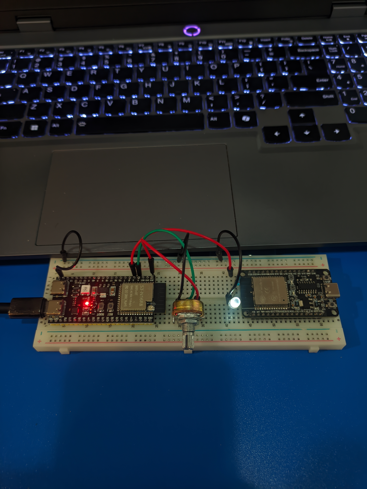

<h1 align="center">ESP32 Analog Input, PWM &amp; DAC</h1>

Laboratory Activity 4 · Arduino sketches and measured results

[Experiments](#the-three-experiments) · [Wiring](#wiring) · [Results](#measured-results) · [Demos](#watch-the-demos)

## The three experiments

<table>
<tr>
<td width="33%" valign="top">
<h3> 01 · Analog input</h3>

Read a potentiometer with the ESP32-S3's 12-bit ADC.

**GPIO4** · **Range:** 0–4095

[View the sketch](code/example3_read_potentiometer.ino)
</td>
<td width="33%" valign="top">
<h3> 02 · PWM dimming</h3>

Map the potentiometer reading to PWM and adjust an LED's brightness.

**Input:** GPIO4 · **LED:** GPIO5

[View the sketch](code/example4_pot_pwm.ino)
</td>
<td width="33%" valign="top">
<h3> 03 · DAC output</h3>

Write five DAC codes on an ESP32-WROOM-32 and measure the voltage.

**Output:** GPIO25 · **Codes:** 0–255

[View the sketch](code/example5_dac_output.ino)
</td>
</tr>
</table>

 <strong>Boards:</strong> Examples 3 and 4 ran on an ESP32-S3-N16R8. Example 5 ran on an ESP32-WROOM-32, which has the built-in DAC used on GPIO25.

<h2> Wiring</h2>

| Experiment | Connections |
| --- | --- |
| Analog input | Potentiometer outer pins → 3.3V and GND; wiper → GPIO4 |
| PWM dimming | Potentiometer as above; LED PWM → GPIO5 through a 220 Ω resistor; LED cathode → GND |
| DAC output | Multimeter red probe → GPIO25; black probe → GND; meter set to DC voltage |

Examples 3 and 4 use an ESP32-S3-N16R8, potentiometer, LED, 220 Ω resistor, breadboard, jumper wires, and USB cable. Example 5 uses an ESP32-WROOM-32 and a multimeter.

<h2> Measured results</h2>

###  01 · ADC readings and mapped duty

| Knob position | ADC reading | Voltage | PWM duty |
| ---: | ---: | ---: | ---: |
| 0% | 0 | 0 mV | 0 |
| ~25% | 859 | 744 mV | 53 |
| ~50% | 1625 | 1313 mV | 101 |
| ~75% | 2733 | 2192 mV | 170 |
| 100% | 4095 | 3076 mV | 255 |

Duty is mapped with `raw ADC × 255 / 4095`. Intermediate knob positions were estimated by hand. At the maximum position, the ADC reached 4095 and stopped increasing.

###  02 · PWM duty and LED brightness

| Knob position | ADC reading | Predicted duty | Observed duty |
| ---: | ---: | ---: | ---: |
| 0% | 0 | 0 | 0 |
| ~25% | 1230 | 76 | 76 |
| ~50% | 1941 | 120 | 120 |
| ~75% | 3319 | 206 | 206 |
| 100% | 4095 | 255 | 255 |

The sketch's predicted and observed duty values matched. The LED became brighter as duty increased.

###  03 · DAC voltage

| DAC code | Predicted voltage | Measured voltage |
| ---: | ---: | ---: |
| 0 | 0.000 V | ~0.3 mV |
| 64 | 0.828 V | ~0.828–0.876 V |
| 128 | 1.656 V | ~1.599–1.661 V |
| 192 | 2.485 V | ~2.450 V |
| 255 | 3.300 V | ~3.208–3.211 V |

Predicted voltage uses `DAC code × 3.3 V / 255`. The meter readings fluctuated while each code was held for two seconds and the display settled. Board and supply tolerances can also affect the result.

<h2> Watch the demos</h2>

> GitHub does not render repository MP4 files as inline README players. The links open the videos in GitHub's viewer.

| Demo | Video |
| --- | --- |
| 01 · IDE and Serial Monitor | [▶ Open video](videos/example3_ide_demo.mp4) |
| 01 · Potentiometer hardware | [▶ Open video](videos/example3_actual_demo.mp4) |
| 02 · IDE and Serial Monitor | [▶ Open video](videos/example4_ide_demo.mp4) |
| 02 · LED hardware | [▶ Open video](videos/example4_actual_demo.mp4) |
| 03 · DAC and multimeter | [▶ Open video](videos/example5_actual_demo.mp4) |

<h2> What the readings show</h2>

- **ADC:** a 12-bit reading ranges from 0 to 4095. When the input reaches the top of its measurable range, the reading saturates. The maximum position in Example 3 produced 4095 and 3076 mV.
- **PWM:** the signal switches between HIGH and LOW. Its duty controls how long it stays HIGH; a value near 128 on an 8-bit scale is about 50% duty.
- **DAC:** the digital code sets an analog output voltage. PWM duty and DAC voltage describe different signals.

The oscilloscope comparison was not performed because an oscilloscope was unavailable and that portion was not required for submission.
